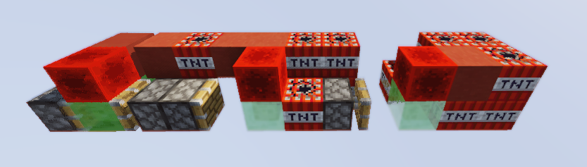
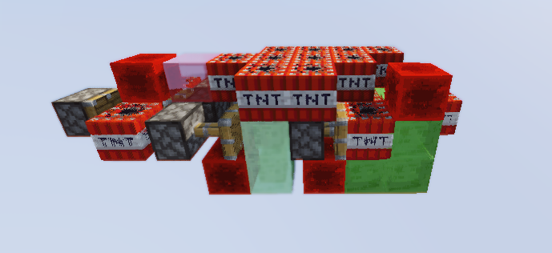
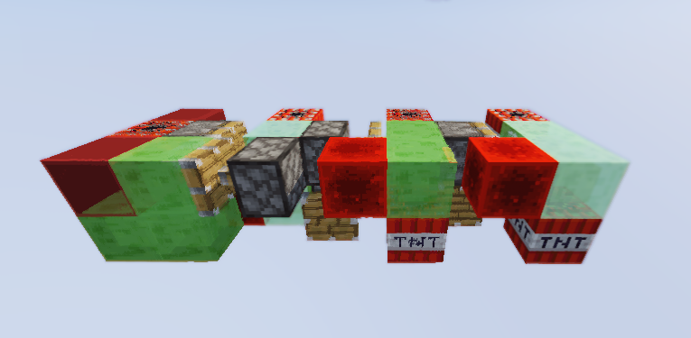
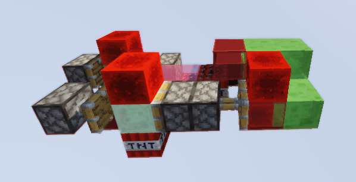

MissileWarsX (or *MwX*) is an open source implementation of the legendary MissileWars mini-game created by SethBling and Cubehamster. This plugin offers a refined experience that is true to the original game. MwX enables other tweaks & performance options that make the game more enjoyable.

## Getting Started

Download the latest build of MissileWarsX from the [Releases](https://github.com/encodeous/MissileWarsX/releases/tag/latest).

MwX requires Paper version 1.16.5+, and supports up to 1.18.2 as of now.

Here are a list of the dependencies required to run MwX:
- ProtocolLib ([SpigotMC](https://www.spigotmc.org/resources/protocollib.1997/))
- FastAsyncWorldEdit 2.x.x ([FAWE](https://intellectualsites.github.io/download/fawe.html))

After collecting all the necessary dependencies, copy the config from the [recommended-config](https://github.com/encodeous/MissileWarsX/tree/dev/recommended-config) folder to the root of your server's directory. These settings are recommended to provide a smooth and consistent experience.

*That's all. You can play around with the plugin config, head on over to the [wiki](https://github.com/encodeous/MissileWarsX/wiki) for more info!*

## Main Features

MissileWarsX has a lot of cool & fancy features that make the gameplay more interesting & smooth.

### Mechanics

- MwX sticks to the classic MissileWars experience, with 2 teams, 5 different types of missiles (see below), fireballs, arrows and shields.
- Fireballs explode when missiles collide with them.
- Ties where both portals are exploded within 5 seconds are recorded. In the case of a tie, statistics will reflect the tie.
- There are two map types, `auto` and `manual`. Players can be automatically distributed to each team when joining, or may choose their own teams.
- Players can practice techniques (like tnt-launching) in `PRACTICE` lobbies, where they can give themselves creative mode.

### Gameplay

- Deaths and Kills with tnt are traced to the person who placed it, naturally, this means that players who planted the winning missile is credited with the win.
- Items have descriptions to help out new players.
- Instant and seamless map reset, without kicking players.
- Players have the ability to break blocks at a faster rate than in Vanilla with their bare hands, useful for breaking redstone blocks. This does not simply use the haste effect.
- MwX displays the player/tab-list with special formatting, adding useful information such as statisics & latency.

### Statistics
- MissileWarsX keeps track of players' activity, and records their statistics.
- The plugin can be configured to automatically calculate TrueSkill rating in Ranked lobbies.

### Default Missiles

Here are the default missiles included with MissileWarsX. These are identical to the ones from the original MissileWars game.

Tomahawk

Shieldbuster

Juggernaut

Lightning

Guardian

## Version Support

As mentioned above, MissileWarsX is currently stable on modern versions of Minecraft (1.16.5+). Older versions may be dropped over time due to the lack of manpower to support them.

## Public Test Server

If you want to try out MissileWarsX before hosting your own server, you can play the mini-game on a publicly hosted server at `msw.encodeous.ca`. This server currently runs 1.18.2, and will run on the latest versions when they come out.

# Contributing and Bug Reporting

If you wish to contribute to this project, or if you find any bugs, please create a pull request or file an issue!
Alternatively, you can message me on Discord: `encodeous#7441`

# Acknowledgements

- Parts of the missile deploy mechanics is referenced from [LlewVallis/OpenMissileWars](https://github.com/LlewVallis/OpenMissileWars)
- This plugin is designed to provide a similar experience to [CubeKrowd](https://www.cubekrowd.net)'s MissileWars
