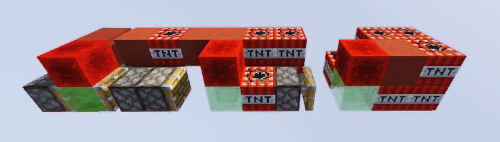
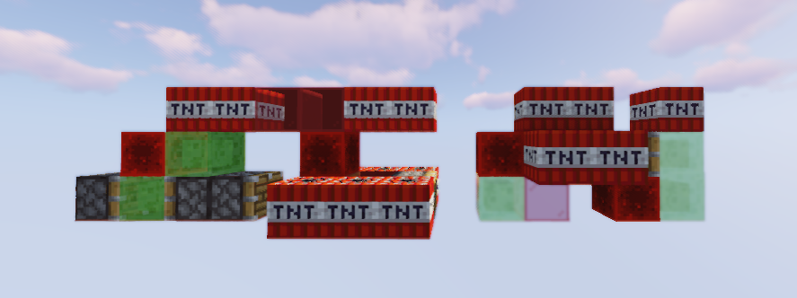
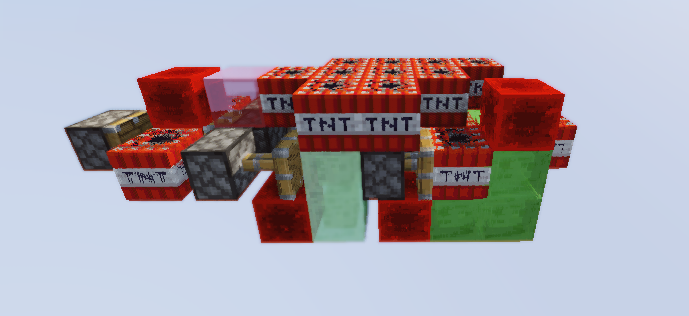
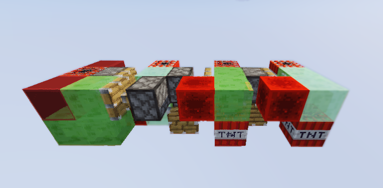
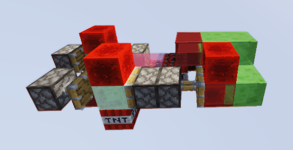

MissileWarsX (or *MwX*) is an open source implementation of the legendary MissileWars mini-game map originally created by SethBling and Cubehamster. This plugin offers a refined experience that is true to the original game, with features closely aligned with the technical and competitive community.

This repo contains the second iteration of MissileWarsX, designed to be more portable and easy-to-maintain. The older version is still available in the Releases, and in the `legacy` branch. Many of the features have been stripped. If you wish something to be added back in, feel free to create an issue.

## Getting Started

#### CAUTION: Do not install MissileWarsX on your existing Minecraft server. It may destroy or alter your existing worlds.

Please install MwX on a fresh server, as specified below:

Download the latest build of MissileWarsX from the [Releases](https://github.com/encodeous/MissileWarsX/releases/tag/latest).

MwX requires [Paper](https://papermc.io/downloads/paper) version 1.21.11.

Here are a list of plugins required to run MwX:
- ProtocolLib ([SpigotMC](https://www.spigotmc.org/resources/protocollib.1997/))
- FastAsyncWorldEdit ([FAWE](https://intellectualsites.github.io/download/fawe.html))

After collecting all the necessary dependencies, copy the config from the [recommended-config](https://github.com/encodeous/MissileWarsX/tree/dev/recommended-config) folder to the root of your server's directory. These settings are recommended to provide a smooth and consistent experience.

*That's all!* You can play around with the plugin config, or add new missiles/maps if you like!

## Main Features

- MwX sticks to the classic MissileWars experience, with 2 teams, 5 different types of missiles (see below), fireballs, arrows and shields.
- Explosions and Fireballs are traced, providing credits to those who carried!
- Ties where both portals are exploded within 5 seconds are recorded.
- Maps resets are seamless. You do not need to disconnect from the server.
- Sound effects for game events can be tweaked in the config
- Items, missiles, and maps are all configurable in the config
- Blocks can have configurable break speeds, can be tweaked in the config

### Default Missiles

Here are the default missiles included with MissileWarsX. These are identical to the ones from the original MissileWars game.

Tomahawk

Shieldbuster

Juggernaut

Lightning

Guardian

# Contributing and Bug Reporting

If you wish to contribute to this project, or if you find any bugs, please create a pull request or file an issue!
Alternatively, you can message me on Discord: `encodeous`

# Acknowledgements

- Parts of the missile deploy mechanics is referenced from [LlewVallis/OpenMissileWars](https://github.com/LlewVallis/OpenMissileWars)
- Thanks to [CubeKrowd](https://www.cubekrowd.net) and its community for playtesting and supporting the development of MissileWars
